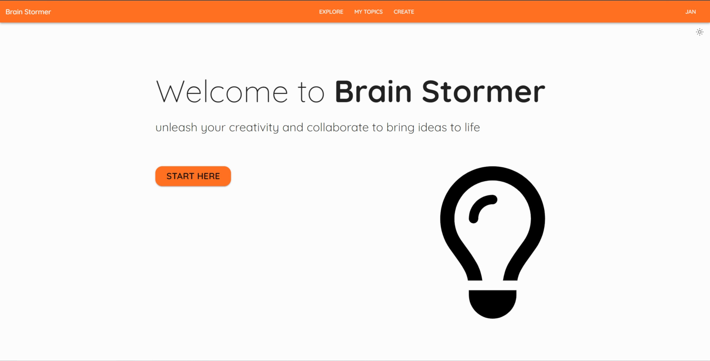
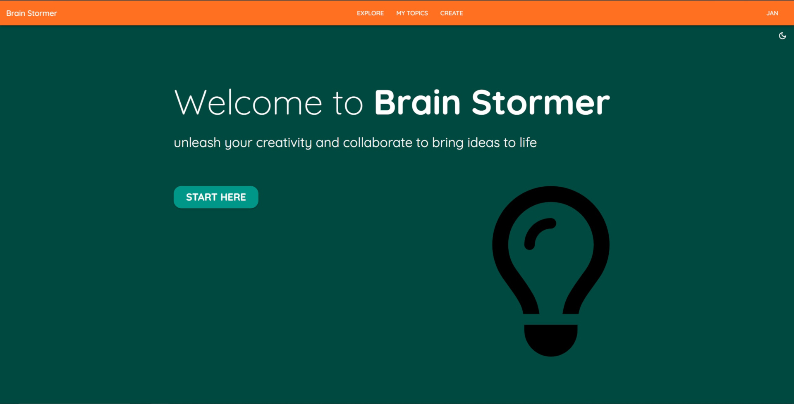
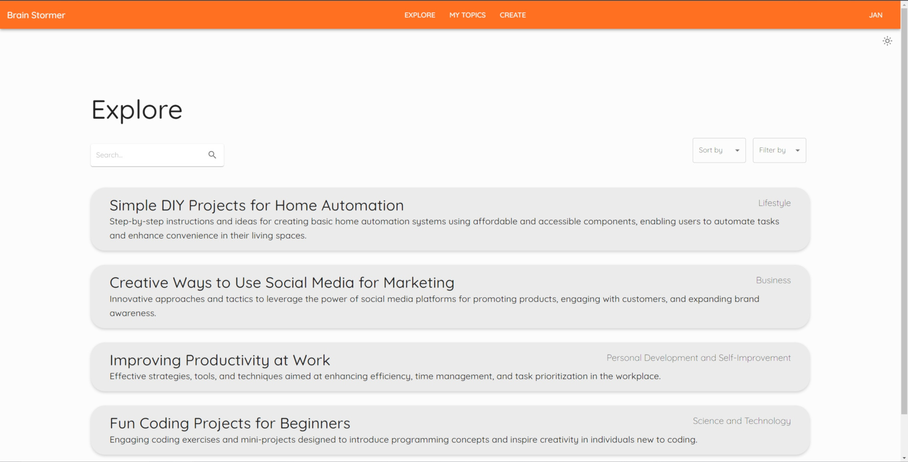
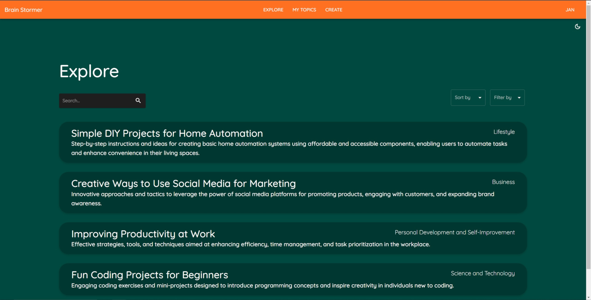
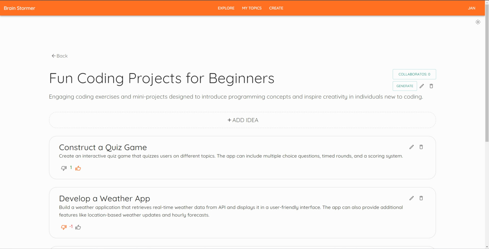
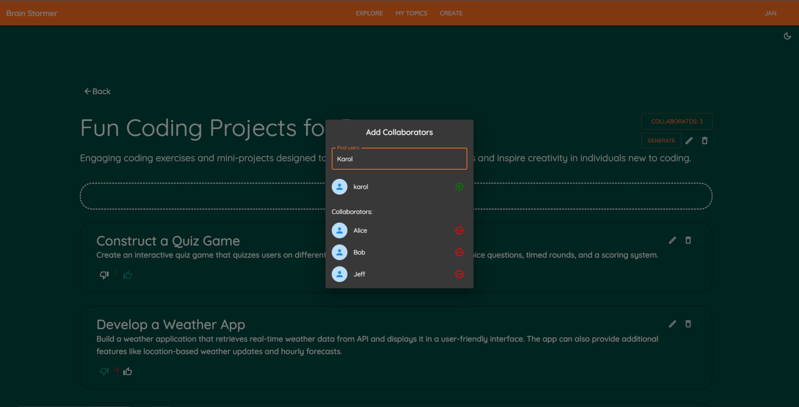
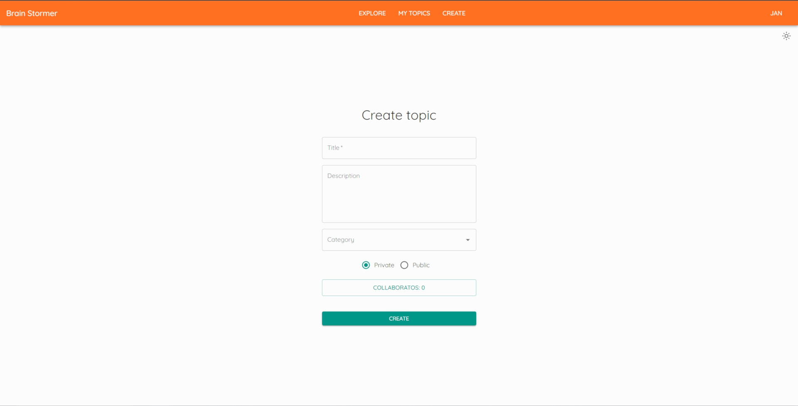
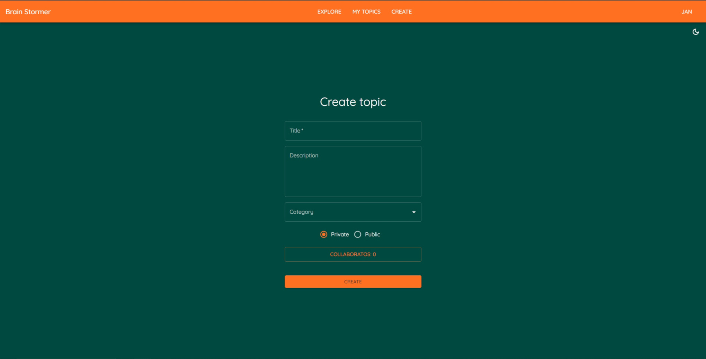

# Brain Stormer

Web application that allows users to collaborate in order to create and evaluate their ideas.
Whether you're working on a team project or just trying to come up with new ideas on your own,
Brain Stormer can help you optimize the brainstorming process and generate innovative solutions.

## Features

- Create topics and assign collaborators
- Submit and evaluate ideas together
- Generate ideas using AI (ChatGPT)
- Explore public topics to find inspiration

## Requirements:

- [Docker](https://www.docker.com/)
- JDK 17
- [Maven](https://maven.apache.org/) (or use IDE built-in Maven support)

## Installation

1. Clone the repository from Github:

       git clone https://github.com/wojzam/Brain-Stormer.git

2. Navigate to the project root directory.

3. Create .env file and add the following line:

       OPENAI_TOKEN=<your_openai_token>
   The OpenAI API token is required for the AI idea generation feature to work.

4. Build the Spring Boot application:

    - Using Maven: If you prefer to use Maven, build the application by running the following command:

           mvn clean install

    - Using IDE: You can use the built-in Maven support or IDE-specific build tools to build the application.

5. Build the Docker images:

       docker-compose build

## Running the App

1. Run the following command to start the app:

       docker-compose up -d

   Once the app is set up, you can access it by visiting http://localhost:3000 in your web browser.

2. To stop the app, you can use the following command:

       docker-compose down

## Technologies

- Spring Boot
- React (with JavaScript, Vite, MUI)
- Apache Kafka (with ZooKeeper)
- PostgreSQL
- Docker

### Database ERD

### Screenshots

|  |  |
|--------------------------------|--------------------------------|
|  |  |
|  |  |
|  |  |